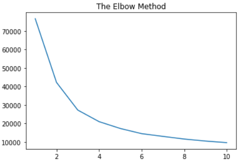
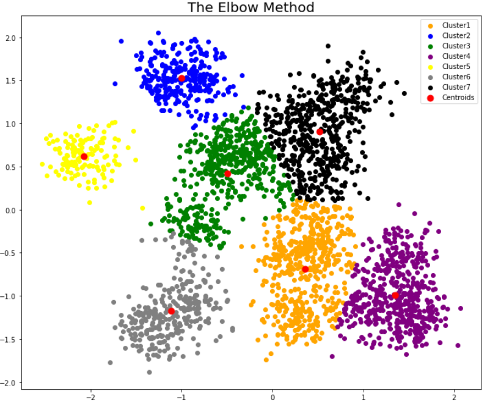

# KMeans Model (Unsupervised Learning)

In this project I implement unsupervised learning model 'KMeans' to cluster differents datasets.

## Dog Horse Dataset
Data source: [Link](https://raw.githubusercontent.com/gumdropsteve/datasets/master/dog_or_horse.csv)

In this dataset we have the *target* variable, i'm going to use this columns to calculate the score of my clustering model.

**Column names:**
- height	
- weight	
- target	
- type

**Plotting model clusters**

## Seattle Weather Dataset
Data Source: [Link](https://raw.githubusercontent.com/gumdropsteve/datasets/master/seattle_weather_1948-2017.csv)

This dataset also have a target variable with which i can calculate the score of the clustering.

**Column names:**
- ds	
- prcp	
- tmax	
- tmin	
- rain

To create the KMeans model i'm going to exclude `ds` because it is a datetime and `rain` that is the target variable.

**Elbow method plot**

## Random Blob KMeans

This model was created using a random dataset generated with `make_blobs` function. This dataset don't have a target column, so this is a truly unsupervised learning model. 

This dataset only have two column.

In this model i create 7 clusters, according to the elbow method of this dataset

**Plotting model clusters**

